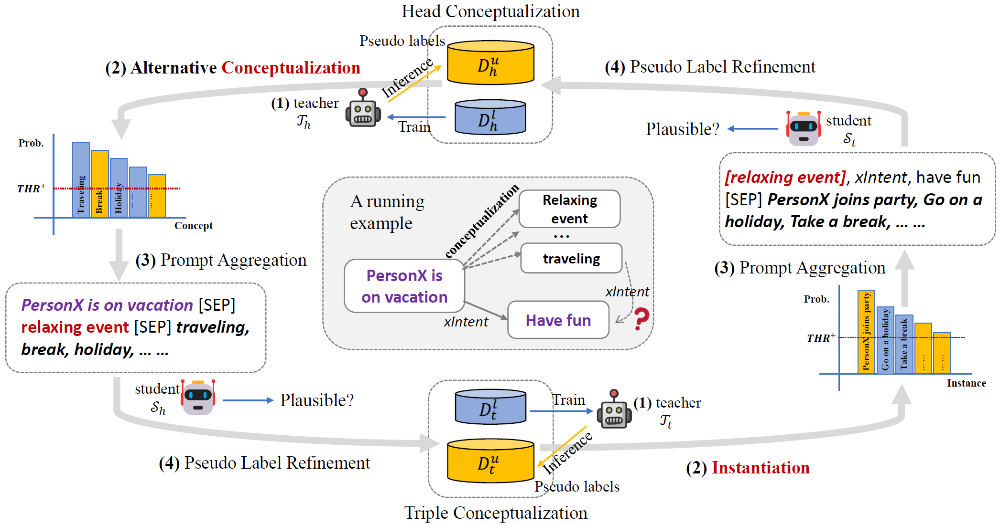

# CAT: A Contextualized Conceptualization and Instantiation Framework for Commonsense Reasoning

This is the official code and data repository for the [ACL2023](https://2023.aclweb.org/) (Main Conference) paper:
[CAT: A Contextualized Conceptualization and Instantiation Framework for Commonsense Reasoning](https://arxiv.org/pdf/2305.04808.pdf).



## 1. Download Dataset/Model Checkpoints

The AbstractATOMIC dataset, including both annotated part and CAT's pseudo-labeled part, and the dataset for training
event conceptualization generators are available
at [this link](https://hkustconnect-my.sharepoint.com/:f:/g/personal/wwangbw_connect_ust_hk/EnA7X6PkeE5Dll9sdlwxuG4BH8zw-Bpdtc5kw3L70Shu5g).

Our finetuned DeBERTa-v3-Large and GPT2 model checkpoints for four tasks are available
at [this link](https://hkustconnect-my.sharepoint.com/:f:/g/personal/wwangbw_connect_ust_hk/EnA7X6PkeE5Dll9sdlwxuG4BH8zw-Bpdtc5kw3L70Shu5g).

## 2. Required Packages

Required packages are listed in `requirements.txt`. Install them by running:

```bash
pip install -r requirements.txt
```

## 3. Training Different Components of CAT

To train the discriminative models of CAT, all training and evaluation codes are provided
in `event_concept_dicrimination` and `triple_discrimination` folders.
The training code are named as `train.py` in each folder and the parameters are all set as default.

```bash
python train.py --ptlm [microsoft/deberta-v3-large or our checkpoint weight]
```

Change the `ptlm` argument to select different pretrained language models or load our fine-tuned checkpoints.

To train the event conceptualization generator and COMET, use the codes provided in `generator` folder.

To train the event conceptualization generator, use the following command:

```bash
GPU=0 \
IN_LEN=40 OUT_LEN=46 OUT_DIR=./GPT2-Conceptualization-Generator \
SAVE_EVERY_EPOCH=False DO_PRED_EVERY_EPOCH=False EVAL_EVERY=100 \
USE_NL_RELATION=True TRAIN_BATCH_SIZE=32 VALID_BATCH_SIZE=32 \
DO_TRAIN=True DO_PRED=False TRAIN_EPOCHS=50 TOKENIZER=gpt2-xl GPT2_MODEL=gpt2-xl \
TRAIN_DATA_PATH=[Training Data Path] \
DEV_DATA_PATH=[Validation Data Path] \
TEST_DATA_PATH=[Test Data Path] \
PRED_FILE=[Prediction File Path] \
REPLACE_BRACKET=True \
python models/comet_atomic2020_gpt2/comet_concept_gpt2.py
```

The training, validation, and testing data can be downloaded
at [this link](https://hkustconnect-my.sharepoint.com/:f:/g/personal/wwangbw_connect_ust_hk/EnA7X6PkeE5Dll9sdlwxuG4BH8zw-Bpdtc5kw3L70Shu5g).

To train COMET, use the following command:

```bash
GPU=0 \
IN_LEN=24 OUT_LEN=40 OUT_DIR=./COMET \
SAVE_EVERY_EPOCH=False DO_PRED_EVERY_EPOCH=False \
EVAL_EVERY=100 USE_NL_RELATION=True TRAIN_BATCH_SIZE=32 VALID_BATCH_SIZE=32 \
DO_TRAIN=True DO_PRED=False TRAIN_EPOCHS=50 TOKENIZER=gpt2-xl GPT2_MODEL=gpt2-xl \
TRAIN_DATA_PATH=[Training Data Path] \
DEV_DATA_PATH=[Validation Data Path] \
TEST_DATA_PATH=[Test Data Path] \
PRED_FILE=[Prediction File Path] \
REPLACE_BRACKET=False \
python models/comet_atomic2020_gpt2/comet_concept_gpt2.py
```

The data format follows the same format as the original input of COMET, details can be found
at [here](https://github.com/allenai/comet-atomic-2020).

## 4. Citing this work

Please use the bibtex below for citing our paper:

```bibtex
@inproceedings{CAT,
  author       = {Weiqi Wang and
                  Tianqing Fang and
                  Baixuan Xu and
                  Chun Yi Louis Bo and
                  Yangqiu Song and 
                  Lei Chen},
  title        = {CAT: A Contextualized Conceptualization and Instantiation Framework for Commonsense Reasoning},
  year         = {2023},
  booktitle    = {Proceedings of the 61st Annual Meeting of the Association for Computational Linguistics, {ACL} 2023}
}
```

## 5. Acknowledgement

The authors of this paper are supported by the NSFC Fund (U20B2053) from the NSFC of China, the RIF (R6020-19 and
R6021-20), and the GRF (16211520 and 16205322) from RGC of Hong Kong, the MHKJFS (MHP/001/19) from ITC of Hong Kong and
the National Key R&D Program of China (2019YFE0198200) with special thanks to HKMAAC and CUSBLT.
We also thank the UGC Research Matching Grants (RMGS20EG01-D, RMGS20CR11, RMGS20CR12, RMGS20EG19, RMGS20EG21,
RMGS23CR05, RMGS23EG08).
